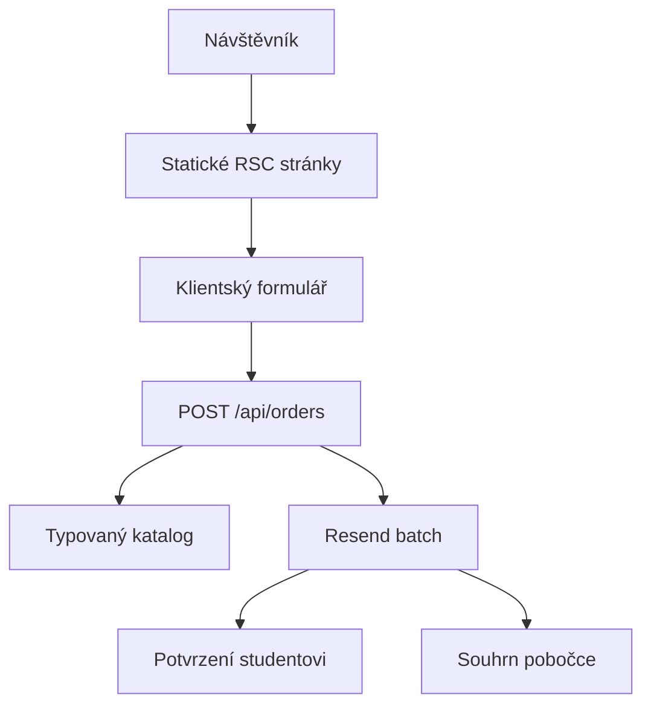

# Architektura

## Přehled

Next.js 16 App Router vykresluje všechny veřejné stránky jako statické HTML při buildu. Dynamický je pouze objednávkový route handler. Aplikace nevyžaduje databázi ani externí stav.

## Vrstvy

- `src/app`: routy, metadata, statické stránky, robots, sitemap a 404.
- `src/components`: sdílené serverové komponenty; `order-form.tsx` je jediná významná klientská komponenta.
- `src/data/catalog.ts`: typovaný zdroj kurzů, poboček, cen, povolených kombinací a adresátů.
- `src/lib/order.ts`: validace payloadu, časová kontrola, allowlist a bezpečné escapování.
- `src/lib/request-security.ts`: same-origin kontrola a paměťový limit pokusů bez uložení čitelné IP adresy.
- `src/lib/email.ts`: server-only Resend batch a lokální test mode.

## Tok přihlášky

1. Klient odešle kontaktní údaje, ID kurzu, ID pobočky, čas otevření formuláře, honeypot a UUID.
2. Endpoint odmítne cizí origin, jiný obsah než JSON a payload nad 20 kB.
3. Zod ověří pole; následuje minimální doba vyplnění a paměťový limit pokusů.
4. Server znovu vyhledá dvojici kurz–pobočka v katalogu a odvodí cenu i příjemce.
5. Resend batch odešle dvě odlišné zprávy s jedním idempotency key.
6. HTTP 201 a děkovací stav vzniknou pouze tehdy, když provider vrátí dvě ID přijatých zpráv.

## Renderování a nasazení

Všechny marketingové routy a detailní stránky kurzů a článků jsou Static/SSG. Objednávková stránka je také statická; query parametry `kurz` a `pobocka` čte po hydrataci malá klientská komponenta. PII se do query nepoužívá. Build je `standalone` pro standardní Node hosting.

Produkční kontejner používá multi-stage Docker build. Z build stage se do runtime stage kopíruje pouze `.next/standalone`, `.next/static` a `public`; vývojové závislosti ani zdrojové soubory v runtime image nejsou. Node proces běží pod neprivilegovaným uživatelem na portu 3000. Statický `/healthz` umožňuje Dockeru a Coolify ověřit dostupnost HTTP serveru bez volání objednávkového endpointu nebo Resendu.

Paměťový rate limit je lokální pro jednu Node instanci. Pro více instancí musí produkční infrastruktura doplnit sdílený limit na proxy/gateway vrstvě; databáze do aplikace kvůli tomu přidána není.
